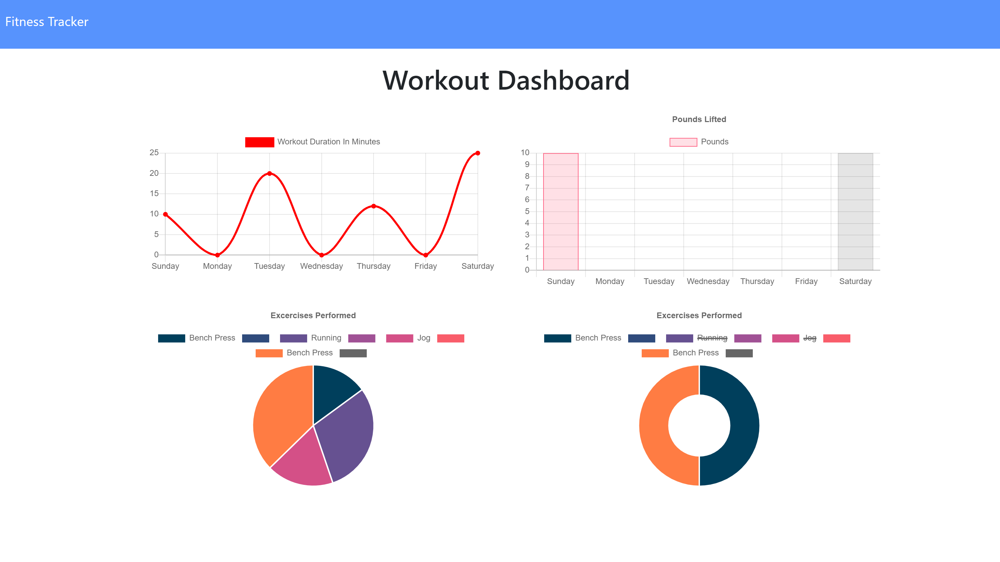

# Workout-Tracker
An application using a Mongo database with a Mongoose schema and handle routes with Express to allow the user to view, create, and track daily workouts.

## User Story
- As a user, I want to be able to view create and track daily workouts. 
- I want to be able to log multiple exercises in a workout on a given day. 
- I should also be able to track the name, type, weight, sets, reps, and duration of exercise. 
- If the exercise is a cardio exercise, I should be able to track my distance traveled.

## Deployed
https://workout-tracker-easy-app.herokuapp.com/

## Contributing
https://github.com/erikabeasley